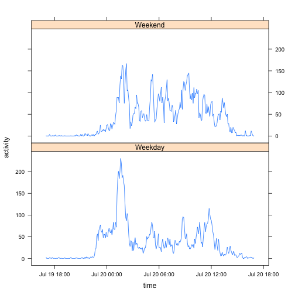

# Reproducible Research: Peer Assessment 1


## Loading and preprocessing the data

```r
# load the zipped file
activity <- read.csv(unz(description='activity.zip', filename='activity.csv'))
# trasform date time and inverval
activity <- transform(activity, Date=as.POSIXlt(date, '%Y-%m-%d', tz='GMT'))
activity <- transform(activity, interval=formatC(interval, width=4, flag='0', format='d'))
# minutes of the day as well as convertion utilities
to.min.of.day <- function(s) {as.integer(substr(s, 1, 2)) * 60 + as.integer(substr(s, 3, 4))}
to.str <- function(x) {paste(formatC(as.character(as.integer(x) %/% 60), width=2, flag='0', format='d'),
                             ':',
                             formatC(as.character(as.integer(x) %% 60), width=2, flag='0', format='d'), sep='')}
to.time <- function(s) {as.POSIXlt(s, '%H:%M', tz='GMT')}
activity <- transform(activity, Time=to.min.of.day(interval))
```


## What is mean total number of steps taken per day?

```r
# compute total number of steps per date
activity.sum.step <- tapply(activity$steps, factor(activity$Date), sum, na.rm=T)
# histogram
hist(activity.sum.step, breaks=10, main='Steps taken per day')
```

 

```r
activity.daily.mean <- mean(activity.sum.step)
activity.daily.median <- median(activity.sum.step)
```

Mean is 9354.2295 and median is 10395.

## What is the average daily activity pattern?

```r
# compute daily activity pattern
activity.hourly <- tapply(activity$steps, activity$Time, mean, na.rm=T)
# plot
plot(to.time(to.str(names(activity.hourly))), activity.hourly, type='l', main='Daily activity pattern')
```

 

```r
# most active time
max.time <- which.max(activity.hourly)
max.time.str <- to.str(names(max.time))
```

Most activty time is  8:35.

## Imputing missing values

```r
# make a copy of the data
activity.imputed <- activity
# go through the rows and impute with the averaged hourly activity level
missing.rows <- 0
for(row in 1:dim(activity)[1]) {
    if(is.na(activity[row, 'steps'])) {
        missing.rows <- missing.rows + 1
        activity.imputed[row, 'steps'] <- activity.hourly[as.character(activity.imputed[row, 'Time'])]
    }
}
# histogram of daily activity
activity.imputed.sum.step <- tapply(activity.imputed$steps, factor(activity.imputed$Date), sum)
hist(activity.imputed.sum.step, breaks=10)
```

 

```r
# imputed mean and median
imputed.activity.daily.mean <- mean(activity.imputed.sum.step)
imputed.activity.daily.median <- median(activity.imputed.sum.step)
```

Number of missing values 2304. Imptued daily mean is 1.0766 &times; 10<sup>4</sup>, and imputed daily median is 1.0766 &times; 10<sup>4</sup>.

## Are there differences in activity patterns between weekdays and weekends?

```r
library(lattice)
# weekday and weekend factor
activity.imputed$is.weekend <- weekdays(activity.imputed$Date) %in% c('Saturday', 'Sunday')
mask <- activity.imputed$is.weekend
# compute daily activity pattern on weekends and weekdays
activity.hourly.weekend <- tapply(activity.imputed$steps[mask], activity.imputed$Time[mask], mean)
activity.hourly.weekday <- tapply(activity.imputed$steps[!mask], activity.imputed$Time[!mask], mean)

# plotting data
dat <- data.frame(activity=c(activity.hourly.weekend, activity.hourly.weekday),
                  is.weekend=factor(c(rep('Weekend', length(activity.hourly.weekend)), rep('Weekday', length(activity.hourly.weekday)))),
                  time=c(to.time(to.str(names(activity.hourly.weekend))), to.time(to.str(names(activity.hourly.weekday)))))
# plotting
xyplot(activity ~ time | is.weekend, data=dat, layout=(c(1, 2)), type='l')
```

 

Yes, weekends has a lot more steps during the middle of the day when the user isn't sitting idle in front of a computer.
